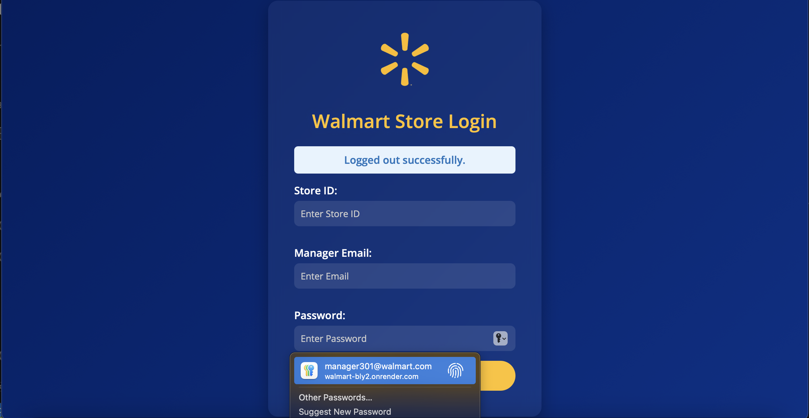
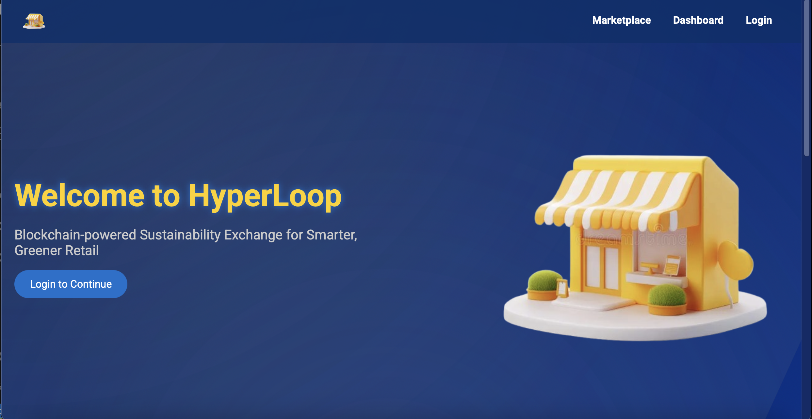
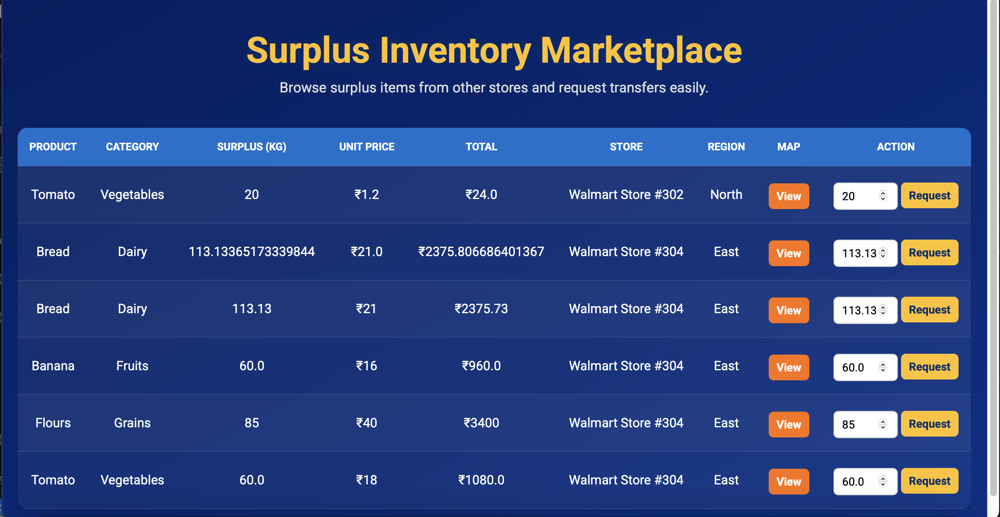
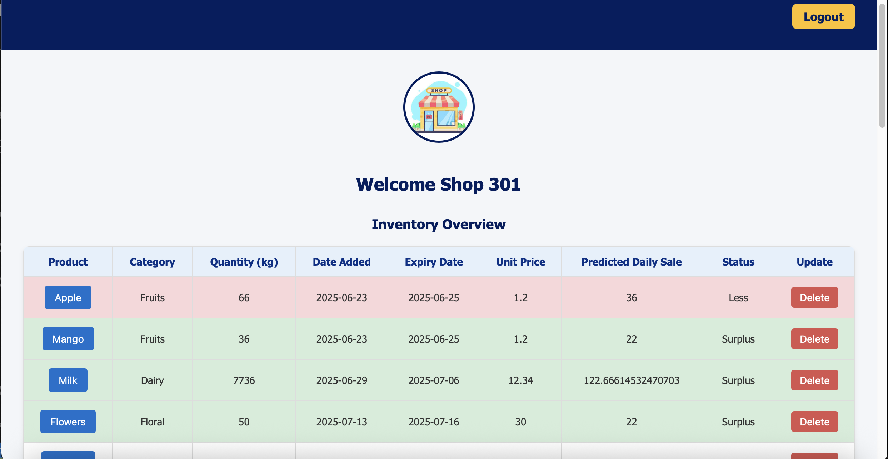
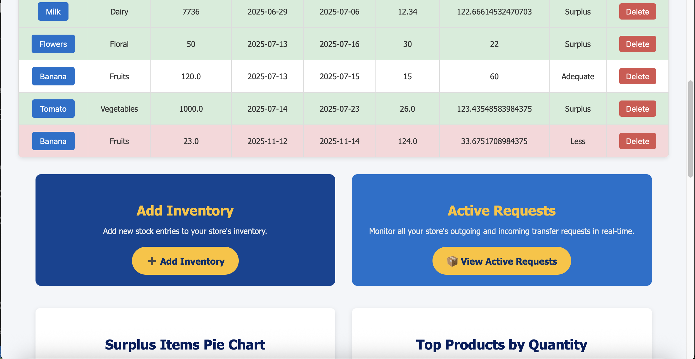
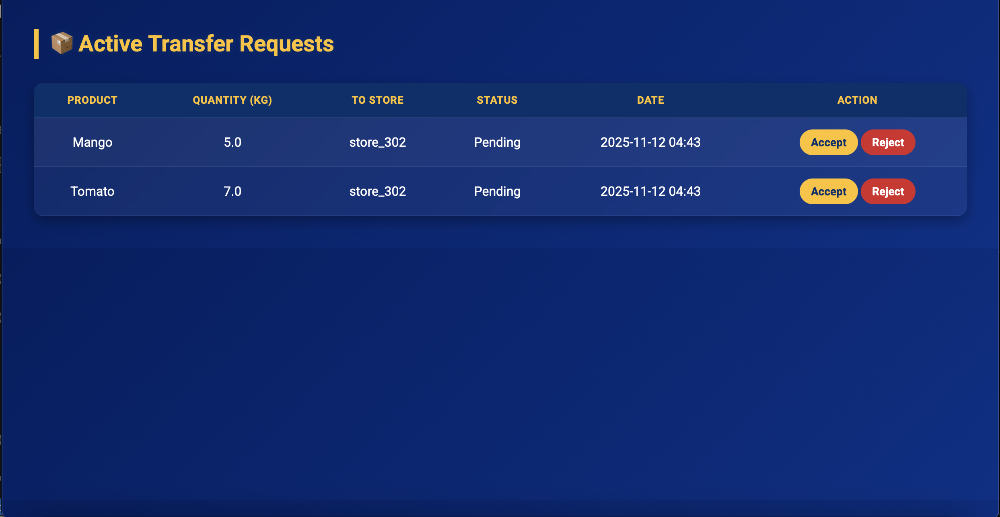
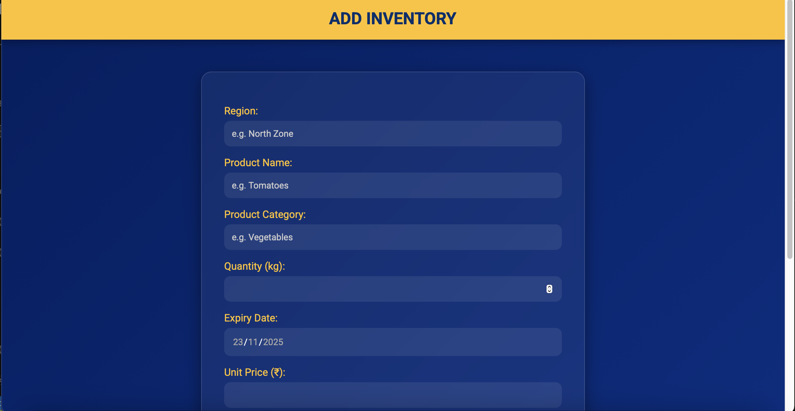
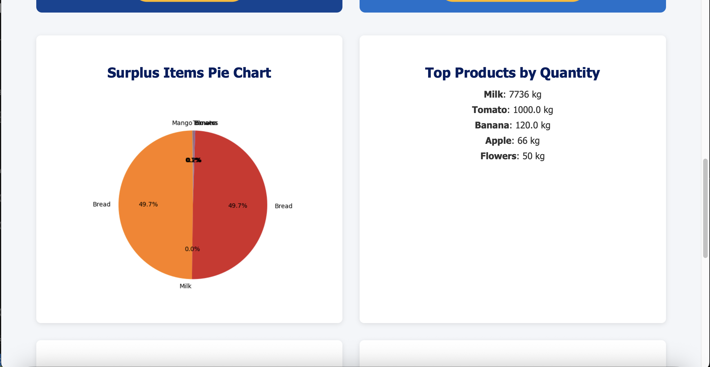
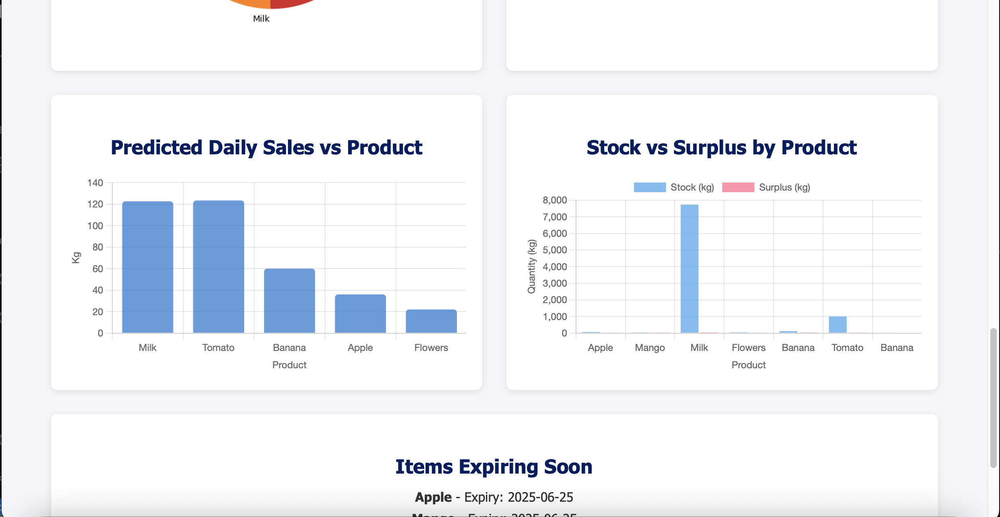
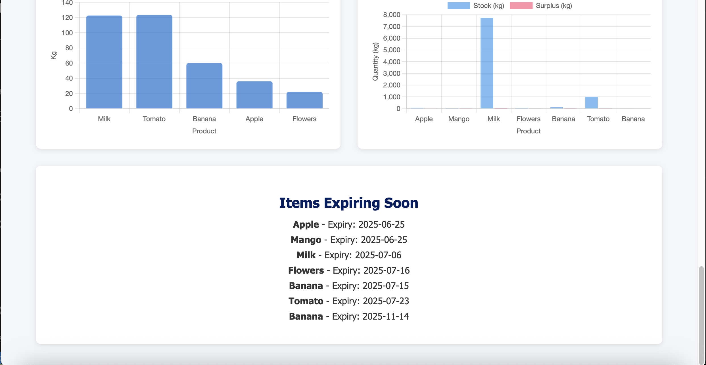

# 🌐 HyperLoop — Walmart Surplus Redistribution Platform

**HyperLoop** is an AI-powered, store-to-store surplus inventory redistribution system built to reduce waste and optimize inventory flow across Walmart stores. It predicts surplus using a trained ML pipeline, recommends transfers to nearby stores in need, manages transfer requests via a lightweight dashboard, and rewards participating stores with Eco Credits.

**Live demo:** https://walmart-bly2.onrender.com

---

##SAMPLE DATA FOR LOGIN
| Store ID   | Manager Email               | Password |
|------------|-----------------------------|----------|
| store_301  | manager301@walmart.com       | 1234     |

---

## 🔥 One-Line Summary
**HyperLoop:** AI-powered surplus redistribution system optimizing Walmart's inventory flow.

---

## 🚀 Key Features
- **Inventory Intake**: Add inventory with metadata (expiry, price, temperature, rainfall, local event).
- **ML-Powered Prediction**: XGBoost-based pipeline predicts demand / surplus per item.
- **Marketplace**: Browse surplus items from other stores and request transfers.
- **Transfer Requests**: Accept / Reject workflow with audit timestamps.
- **Eco Credit System**: Award credits for confirmed transfers to incentivize sustainability.
- **Dashboards & Charts**: Visualize surplus distribution and Eco Credits per store.
- **Lightweight, extendable Flask app** with MongoDB persistence.

---

## 🧩 Tech Stack
- **Backend**: Flask (Python)
- **Database**: MongoDB (PyMongo)
- **ML**: XGBoost, scikit-learn, pandas
- **Visualization**: matplotlib (for saved charts)
- **Deployment**: Gunicorn / Render (production), local Flask for dev
- **Other**: python-dotenv for environment configuration

---

## ⚙️ How it works (end-to-end - concise)
1. **Login** — store manager authenticates (store id, email, numeric password).
2. **Add Inventory** — manager submits product details + environment (temp, rainfall) and local event flag.
3. **Prediction** — `pipe.pkl` (preprocessing + XGBoost) predicts expected daily sale or required quantity.
4. **Labeling** — system compares predicted vs actual stock → marks item as `surplus` or `less` and computes `surplus_kg` / `less_kg`.
5. **Marketplace** — surplus items are listed (except from the same store). Other stores can request quantities.
6. **Requests** — recipient sends a `transfer_request` (Pending). Sender sees incoming requests on `active-requests`.
7. **Accept / Confirm** — when confirmed, inventory is updated for both stores and **Eco Credits** are awarded to the sender; transfers are logged.
8. **Dashboard** — store sees inventory, generated charts, and Eco Credits balance.

# 🔌 Important Endpoints Overview

### **Authentication & Session**
- **GET** `/login` — Login page  
- **POST** `/login` — Authenticate and set session (`store_id`, `region`)  
- **GET** `/logout` — Clear session  

---

### **Dashboard & Inventory**
- **GET** `/dashboard` — Store dashboard (inventory, eco credits, charts)  
- **POST** `/add-inventory` — Add new inventory *(triggers ML prediction & status setting)*  

---

### **Marketplace & Transfers**
- **GET** `/marketplace` — List available surplus items from other stores  
- **POST** `/request-transfer` — Request an item transfer from a store  
- **GET** `/active-requests` — View incoming requests *(for recipient or sender depending on implementation)*  
- **POST** `/update-request` — Accept/Reject request  
  - **On Accept:** Updates inventories + awards eco credits  

---

# 🧠 ML Model & Pipeline Details

### **Input Features**
| Feature            | Type        | Description |
|--------------------|-------------|-------------|
| `region`           | Categorical | Store's geographic region |
| `item_name`        | Categorical | Name of the inventory item |
| `day_of_week`      | Categorical | Day when data is recorded |
| `quantity_in_stock`| Numeric     | Current quantity available |
| `price_per_kg`     | Numeric     | Price per kilogram |
| `expiry_days`      | Numeric     | Days until item expires |
| `local_event`      | Binary      | Whether a local event is happening (0/1) |
| `temperature`      | Numeric     | Temperature in °C |
| `rainfall`         | Numeric     | Rainfall in mm |

---
## 📸 Project Demo

Below are screenshots demonstrting the project

  
    

  
    
  
    
  
    
  
    
  
    
  
    
  
    
  
    
  
    

